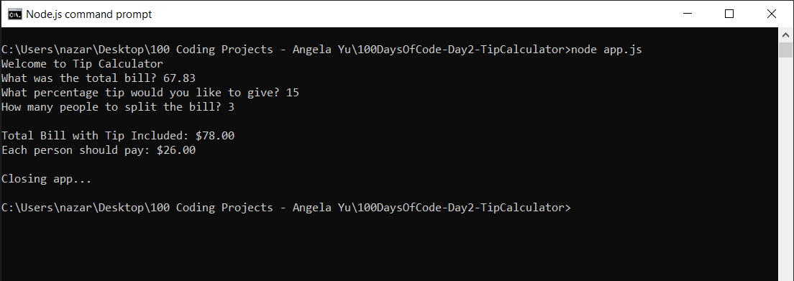

# 100 Days of Code - Day 2 - Tip Calculator

# Prompt

Write a program that has the following console features:

* Write "Welcome to the Tip Calculator"
* Ask the user for the total amount of their bill
* Ask the user what tip percentage they would like to give
* Ask the user for the number of people that are splitting the bill
* Display the amount each person should pay
* Format all monetary values to 2 decimal places

# Example

Welcome to the Tip Calculator

What was the total bill? $124.56

What percentage tip would you like to give? 12

How many people to split the bill? 7

Each person should pay: $19.93.

# Screenshot of Working Solution

